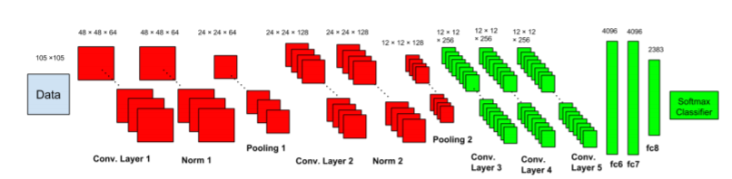

# Font Recognition Using Deep Learning - DeepFont ( Adobe )

DeepFont [Paper](https://arxiv.org/pdf/1507.03196v1.pdf) is a technique created by Adobe.Inc to detect font from images using deep learning . They published their work as a paper for the public . Inspiring their work , I converted their thesis to a  working code .

##### Keypoints of DeepFont:
- Its trained on AdobeVFR Dataset which contains 2383 Font Categories 
- Its Domain adapted CNN
- Its Learning is based upon Model Compression

The work is splited into 4 steps : 
* **Dataset:**
    Since AdobeVFR Dataset [datalink](https://www.dropbox.com/sh/o320sowg790cxpe/AADDmdwQ08GbciWnaC20oAmna?dl=0) is huge in size and contains lot of font categories . We created custom dataset based upon required font patches using **TextRecognitionDataGenerator** [github](https://github.com/Belval/TextRecognitionDataGenerator). The sample folder will be available in this repo.

* **Preprocessing of Dataset:** 
    Fonts are not like objects , to have to huge spatial information to classify their features . To identify very minute feature change deepfont used certain preprocessing techniques they are
    * **Noise**
    * **Blur**
    * **Perpective Rotation**
    * **Shading (Gradient Illumination )**
    * **Variable Character Spacing**
    * **Variable Aspect Ratio**

* **CNN Architecture:**
    Unlike other image classification CNN network , they followed a new schema like two subnetworks,
    * **Low Level Sub-Network** : Learned from the composite set  of synthetic and real-world data.
    * **High Level Sub-Network** : Learns a deep classifier from the low level features 
    For more details and clarification have a read of their [paper](https://arxiv.org/pdf/1507.03196v1.pdf)

* **Framework ( Keras ):**
    As its prototyping , I used Keras to build the entire pipeline . Feel free to prototype in other frameworks.

                   Thanks to DeepFont Team for their amazing work
